# Travel Agent

A Chinese-language travel assistant, and the pipeline that trains it.

The assistant answers travel questions by calling five tools: trip planning,
directions, hotel recommendations, hotel reviews, and weather. Its behaviour is
defined by a system prompt that routes every request into one of five workflows
and specifies exactly which tools to call, in what order, and when to ask a
clarifying question instead.

The repository does two things:

1. **Runs the assistant** against a live model (`qwen-plus` by default) with real
   tool implementations, plus a Milvus-backed RAG service over 361 city travel
   guides.
2. **Trains a smaller model to imitate it.** Synthetic user requests are rolled
   out through the live assistant, the resulting tool-calling conversations
   become the training set, and a Qwen3 checkpoint is LoRA fine-tuned on them.

Everything user-facing is Chinese: prompts, tool descriptions, tool results, and
the JSON keys of the datasets. Code, comments, and docstrings are English.

## The five workflows

The router lives entirely in the system prompt (`agent/assistant.py`). Each
workflow first checks whether it has enough information, asks a single
clarifying question if not, and only then calls tools.

```mermaid
flowchart TD
    U([User request]) --> R{Route the request}

    R -->|trip planning| W1
    R -->|directions| W2
    R -->|hotels| W3
    R -->|travel chat| W4
    R -->|off-topic| W5

    subgraph W1["1 · Trip planning"]
        A1{Destination known?} -->|no| A1Q[/"Which city do you<br/>want to travel to?"/]
        A1 -->|yes| A2{Travel date known?}
        A2 -->|no| A2Q[/"When do you plan<br/>to travel?"/]
        A2 -->|yes| A3["① search_travel_guide"]
        A3 --> A4{Guide found?}
        A4 -->|no| A5["Report: no route available<br/>(skip weather)"]
        A4 -->|yes| A6["② get_weather_info"]
        A6 --> A7["Day-by-day plan<br/>+ daily weather"]
    end

    subgraph W2["2 · Directions"]
        B1{Destination known?}
        B1 -->|no| B1Q[/"Where do you<br/>want to go?"/]
        B1 -->|yes| B2["query_route<br/>(origin = start coordinates,<br/>city = current city id)"]
        B2 --> B3{Route found?}
        B3 -->|no| B4["Report: no route found"]
        B3 -->|yes| B5["Walking · transit · driving<br/>options"]
    end

    subgraph W3["3 · Hotels"]
        C0{Recommendation<br/>or review?}
        C0 -->|recommend| C1{City known?}
        C1 -->|no| C1Q[/"Which city should I<br/>search for hotels in?"/]
        C1 -->|yes| C2["① recommend_hotels"]
        C2 --> C3{Any hotels?}
        C3 -->|no| C4["Report: none found<br/>(skip reviews)"]
        C3 -->|yes| C5["② get_hotel_reviews<br/>for each hotel"]
        C5 --> C6["Hotels + reviews,<br/>answered together"]
        C0 -->|review| D1{Hotel named?}
        D1 -->|no| D1Q[/"Which hotel do you<br/>want reviews for?"/]
        D1 -->|yes| D2["get_hotel_reviews"]
    end

    subgraph W4["4 · Travel chat"]
        E1["Answer directly,<br/>call no tools"]
    end

    subgraph W5["5 · Refusal"]
        F1["Politely decline:<br/>travel questions only"]
    end
```



Three rules in the prompt matter more than the rest, because the training data
encodes them and a model that breaks them is wrong in a way that is easy to miss:

- **Trip planning is strictly ordered.** `search_travel_guide` runs first. Only
  if it returns something does `get_weather_info` run. An empty guide result
  short-circuits to "no route available".
- **Hotel recommendation is two rounds, never one.** The assistant must not reply
  after `recommend_hotels`; it must then call `get_hotel_reviews` and answer once
  with both. This is the single most-emphasised instruction in the prompt.
- **Ask one thing at a time.** When information is missing, the assistant asks a
  single clarifying question rather than guessing or asking for everything.

### Workflow labels vs. the prompt

The prompt numbers four workflows and folds refusal into the chat workflow. The
datasets use five labels, splitting refusal out:

| `工作流` | Label | Meaning | Seed rows |
|---|---|---|---|
| 1 | `旅行规划` | Trip planning | 450 |
| 2 | `问路` | Directions | 120 |
| 3 | `查询酒店` | Hotels | 240 |
| 4 | `旅行相关` | Travel chat | 100 |
| 5 | `拒答` | Refusal | 100 |

Rows also carry `是否追问` (`是`/`否`) recording whether the exchange needs a
clarifying question. Only workflows 1–3 have follow-up variants.

## Tools

| Tool | Backed by | Real? |
|---|---|---|
| `search_travel_guide` | Milvus over 361 city guides, via the RAG service | yes |
| `get_weather_info` | QWeather API | yes |
| `query_route` | Amap directions + geocoding | yes |
| `recommend_hotels` | an LLM asked to invent plausible hotels | **fabricated** |
| `get_hotel_reviews` | an LLM asked to invent plausible reviews | **fabricated** |

The two hotel tools return synthetic data. That is fine for teaching a model the
*shape* of a tool-calling conversation, which is what this pipeline is for, but
the hotel content is not real and must not be presented to end users as such.

## Layout

```
llm_client/   client.py      LLMManager over 10 model configs
agent/        assistant.py   the assistant: system prompt, tool dispatch, history
tools/        route.py weather.py hotel.py
rag/          service.py     Flask retrieval service on port 8010
              ingest.py      embeds the guides into Milvus (destructive)
paths.py                     every filesystem location and checkpoint path
pipeline/                    data generation, six stages
training/                    LoRA fine-tuning
tests/
configs/      all_tools.json  city_code_mapping.json
data/         raw/travel_guides/ (361)  seed/  processed/  milvus.db
_archive/                    retired code, not imported
```

## Data pipeline

Each stage feeds the next. Run with `python -m pipeline.<stage>`.

```
generate_seed_dataset     1010 synthetic requests across the 5 workflows
        ↓
split_dataset             stratified 80/20 → 808 train / 202 test
        ↓
convert_to_conversations  rolls each request through the live assistant and
                         the RAG service, emitting OpenAI tool-call
                         conversations                        ← costs API calls
        ↓
merge_batches             merges the per-worker shards
        ↓
split_conversations       one truncated copy per assistant turn,
                         final turn tripled: 808 → 2207
```

`generate_travel_guides` sits outside this chain — it produced the 361 raw guides
that `rag.ingest` embeds.

The last stage matters for training. Because it emits one sample per assistant
turn, `--only_last_assistant` is the correct masking mode for its output;
supervising every assistant turn would count the earlier ones repeatedly.

## Training

```bash
./training/run_train_last_assistant.sh          # override MODEL_PATH / OUTPUT_DIR
python -m training.merge_lora                   # fold adapter into base weights
python -m training.infer --show_template        # inspect the rendered prompt
```

`training/dataset.py` builds the samples and the loss mask. It locates assistant
token spans by prefix-differencing — tokenizing `messages[:i+1]` repeatedly and
diffing lengths — then sets every non-assistant label to `-100`. Despite its
name it is a library, not a debug viewer; the trainer imports it. It also has a
CLI that visualises which tokens are supervised.

Checkpoint locations come from `paths.py` so that `merge_lora` merges into the
same base `train_lora` trained against, and `infer` reads exactly where
`merge_lora` writes. Override per machine:

```bash
TRAVEL_AGENT_BASE_MODEL=/models/qwen3-0_6b
TRAVEL_AGENT_ADAPTER_DIR=/models/adapter
TRAVEL_AGENT_MERGED_MODEL=/models/merged
```

## Setup

```bash
pip install -r requirements.txt
```

No `pip install -e .` is needed — every package sits at the repository root.

Credentials. The Amap key is read from the environment and the process fails
without it:

```bash
export AMAP_KEY=...
```

The DashScope and QWeather keys are still empty string placeholders in
`llm_client/client.py`, `rag/service.py`, `rag/ingest.py` and `tools/weather.py`;
fill them in before running anything that calls those services.

Running the RAG service:

```bash
python -m rag.ingest        # WARNING: drops the collection and re-embeds all
                           # 361 guides, re-billing the embedding API
python -m rag.service       # serves on http://127.0.0.1:8010
```

`rag.service` exposes `GET /health`, `POST /search`, `POST /search_by_location`
and `GET /stats`. Retrieval runs in three stages: a location-priority scalar
filter, weighted reciprocal-rank fusion (k=60) over vector and keyword hits, then
a score threshold.

Guides are embedded whole — one file is one row, 361 rows, no chunking. There is
an 8192-character truncation guard before the embedding call, but it never fires:
the longest guide is 2462 characters.
